<!--
  Profile README for github.com/dat-rd
  Flow: Hero → Currently exploring → Building → Trace → Links
  Hero assets: assets/hero-light.svg, assets/hero-dark.svg
  Principle: the profile creates curiosity, the repositories provide evidence.
-->

<picture>
  <source media="(prefers-color-scheme: dark)" srcset="assets/hero-dark.svg">
  
</picture>

 

## Currently exploring

AI&nbsp;Agents&nbsp;↗ &nbsp;&nbsp; AI&nbsp;Applications&nbsp;↗ &nbsp;&nbsp; Software&nbsp;Engineering&nbsp;↗ &nbsp;&nbsp; Enterprise&nbsp;Systems&nbsp;↗

<i>A direction, not a list of credentials.</i>

 

## Building

**CV AI** &nbsp;—&nbsp; AI × Career 
**WaroTrans** &nbsp;—&nbsp; Enterprise × Robotics &nbsp;<i>in&nbsp;progress</i> 
**AutoWash Pro** &nbsp;—&nbsp; Business × Software 
**WellStudy** &nbsp;—&nbsp; Web × Learning

 

## Trace

**FPT Software** &nbsp;—&nbsp; SAP&nbsp;ABAP · Enterprise&nbsp;Software 
**FPT University** &nbsp;—&nbsp; Software Engineering

 
 

[X](https://x.com/xnguyenthanhdat) &nbsp;·&nbsp; [Email](mailto:thanhdat.rd.70369@gmail.com)

